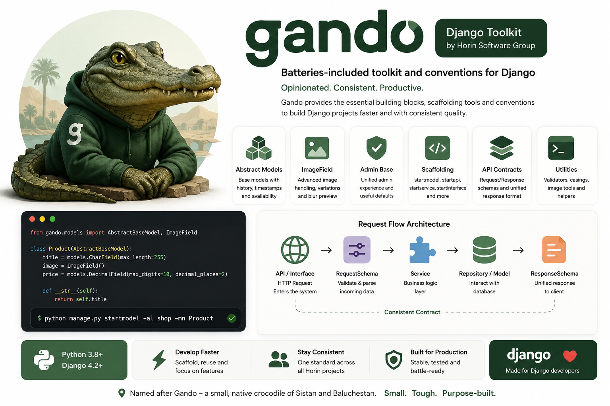

# Gando — a batteries-included Django toolkit

[](https://pypi.org/project/gando/)
[](https://pypi.org/project/gando/)
[](https://www.djangoproject.com/)
[](./LICENSE)

**Gando** gives Django/DRF projects a consistent spine: soft-delete abstract
models, opinionated admin, typed model fields (images, phone, username,
password), a single standardized API response envelope, request/client helpers,
and management commands that scaffold a clean service-layer app in seconds.
It exists so that every project in an engineering org speaks the same
error/response shape and the same folder conventions — less copy/paste, faster
onboarding, fewer bespoke wrappers to maintain.

Named after the *Gando* — a small, tough crocodile native to Sistan and
Baluchestan in Iran: compact and purpose-built.



---

## Status

Gando is a real, actively maintained toolkit built by **Horin Software Group**,
extracted from production Django services and published for reuse. It is used in
production today. Releases follow [Semantic Versioning](https://semver.org/) and
every change is recorded in [`CHANGELOG.md`](./CHANGELOG.md). `2.3.0` and `2.3.1`
were back-to-back hardening passes (bug fixes found by writing real tests for
previously-uncovered code, packaging corrections, a test suite grown from
zero to 198 tests) — see [Design notes & recent hardening](#design-notes--recent-hardening).

> **Note — Python 3.14+ is required.** `ModelClass.id` (the base of every
> model built on `AbstractBaseModel`) defaults to `uuid.uuid7`, which the
> standard library only gained in 3.14. This is reflected in
> `python_requires`, not just documented here — `pip install` will refuse
> older interpreters.

---

## Table of contents

1. [Key features](#key-features)
2. [Install](#install)
3. [Quickstart (5 minutes)](#quickstart-5-minutes)
4. [Core concepts & architecture](#core-concepts--architecture)
5. [Examples: model → admin → API → response](#examples-model--admin--api--response)
6. [Management commands / scaffolding](#management-commands--scaffolding)
7. [Response & request contract](#response--request-contract)
8. [Design notes & recent hardening](#design-notes--recent-hardening)
9. [Development & tests](#development--tests)
10. [Contributing](#contributing)
11. [License & contact](#license--contact)

---

## Key features

* **Soft-delete abstract models.** `AbstractBaseModel` combines timestamps,
  a `simple_history` audit trail, an `available` flag and an `is_deleted`
  soft-delete marker. Its default manager (`AbstractBaseModelManager`)
  transparently filters out deleted/unavailable rows (`is_deleted=False,
  available=1`), so ordinary queries never see soft-deleted records.
* **Rich, typed model fields** (`gando.models.fields`): a composite `ImageField`
  (with an `ImageProperty` descriptor), a computed `BlurBase64Field` low-res
  preview, plus validated `PhoneNumberField`, `UsernameField`, `PasswordField`
  and `BooleanNumberField`.
* **Opinionated admin.** `BaseModelAdmin` gives every model consistent list,
  filter, search and readonly behavior — including automatic `id` / `available`
  / created / updated columns — out of the box.
* **One API response envelope.** `BaseAPI` (a DRF `APIView`) wraps every
  response — success or exception — into a single, predictable JSON shape, so
  clients write their parsing and error handling exactly once.
* **Service-layer building blocks.** `BaseService` and its specialized
  variants (`BaseCreatorService`, `BaseGetterService`, `BaseUpdaterService`,
  `BaseGetterCreatorService`, `BaseDataBaseManagerService`) plus
  `BaseInterface` structure business logic away from views.
* **Scaffolding commands.** `startmodel`, `startapi`, `startservice`,
  `startinterface` generate the conventional `repo/` package layout so new
  features start consistent.
* **Utilities.** String casing helpers, an image blur-preview converter,
  uploaders, and request/response helpers.

---

## Install

```bash
pip install gando
```

For local, editable development:

```bash
git clone https://github.com/navidsoleymani/gando.git
cd gando
pip install -e .
```

**Requirements** (declared in `setup.py`):

* `python_requires='>=3.14'` — `gando.models.abstract_model_class.ModelClass.id`
  defaults to `uuid.uuid7`, added to the standard library in Python 3.14; the
  codebase also uses PEP 604 (`X | Y`) unions at runtime (3.10+), but the
  `uuid.uuid7` dependency is the real floor.
* Runtime dependencies (conservative lower bounds, no upper caps):
  `Django>=4.2`, `djangorestframework>=3.14`, `pydantic>=2.0`, `Pillow>=9.0`,
  `django-simple-history>=3.3`, `django-filter>=23.0`, `markdown>=3.4`,
  `httpx>=0.24`. `pydantic>=2` is a hard requirement — gando calls the v2-only
  `model_dump()` API.

---

## Quickstart (5 minutes)

**1. Add gando to `INSTALLED_APPS`** in `settings.py`:

```py
INSTALLED_APPS = [
    # ...
    "simple_history",   # gando's audit trail depends on it
    "gando",
    # your apps
]
```

**2. Define a model** on top of the soft-delete base:

```py
from django.db import models
from gando.models import AbstractBaseModel


class Article(AbstractBaseModel):
    title = models.CharField(max_length=300)
    body = models.TextField()

    def __str__(self):
        return self.title
```

`Article.objects.all()` now returns only rows where `is_deleted=False` and
`available=1`, and every write is recorded in the history table automatically.

**3. Add typed fields** where you need them:

```py
from django.db import models
from gando.models import AbstractBaseModel
from gando.models.fields import ImageField, PhoneNumberField


class Profile(AbstractBaseModel):
    # ImageField is a composite field: it also creates companion columns such
    # as `avatar_src` and an auto-computed blurred base64 preview
    # (`avatar_blurbase64`) — no extra wiring needed.
    avatar = ImageField()
    phone = PhoneNumberField()
    display_name = models.CharField(max_length=255)
```

**4. Register the model** with the standard admin:

```py
from django.contrib import admin
from gando.admin.models import BaseModelAdmin
from .models import Profile


@admin.register(Profile)
class ProfileAdmin(BaseModelAdmin):
    list_display = ["display_name", "phone"]
```

**5. Migrate and run:**

```bash
python manage.py makemigrations
python manage.py migrate
python manage.py runserver
```

That's a working, audited, soft-deleting model with a consistent admin — in
five steps.

---

## Core concepts & architecture

Gando is built around a few deliberate ideas:

* **Conventions over configuration.** Sane defaults (timestamps, availability,
  soft delete, admin columns, response shape) mean teams stay consistent
  without wiring the same plumbing on every project.
* **Separation of concerns.** Views stay thin; business logic lives in
  services. The conventional flow is:
  `API (BaseAPI) → Interface/Service → Models → Schemas → standardized Response`.
* **One contract, everywhere.** A single response envelope (`BaseAPI`) and
  request/response schemas keep server and client from drifting apart.
* **Scaffold-first.** Management commands generate a consistent `repo/` package
  layout (`admin/`, `models/`, `schemas/`, `services/`, `interfaces/`,
  `apis/`, `urls/`) so new features start life in the right shape.

**Import map** (flat, `2.x` layout):

| Import | What you get |
| --- | --- |
| `from gando.models import AbstractBaseModel` | soft-delete abstract base model |
| `from gando.models.fields import ImageField, BlurBase64Field, PhoneNumberField, UsernameField, PasswordField, BooleanNumberField` | typed model fields & validators |
| `from gando.admin.models import BaseModelAdmin` | opinionated `ModelAdmin` base |
| `from gando.apis import BaseAPI, ListAPIView, RetrieveAPIView, CreateAPIView, UpdateAPIView, DestroyAPIView` | DRF views with the standard envelope |
| `from gando.services import BaseService, BaseCreatorService, BaseGetterService, BaseUpdaterService, BaseGetterCreatorService, BaseDataBaseManagerService` | service-layer bases |
| `from gando.interfaces import BaseInterface` | interface base |
| `from gando.schemas import AbstractBaseSchema, AbstractBaseSchemaModel` | pydantic schema bases |

---

## Examples: model → admin → API → response

**Model** — an audited, soft-deleting banner:

```py
from django.db import models
from gando.models import AbstractBaseModel
from gando.models.fields import ImageField


class Banner(AbstractBaseModel):
    title = models.CharField(max_length=200)
    image = ImageField()
```

**Service** — keep query/business logic out of the view:

```py
from gando.services import BaseService
from .models import Banner


class BannerService(BaseService):
    def get_banner(self, banner_id):
        # AbstractBaseModel's manager already excludes soft-deleted rows.
        return Banner.objects.filter(id=banner_id).first()
```

**API** — a DRF view that returns a plain `Response`; gando wraps it into the
standardized envelope in `finalize_response`:

```py
from rest_framework import status
from rest_framework.response import Response
from gando.apis import BaseAPI
from .services import BannerService


class BannerAPI(BaseAPI):
    def get(self, request, banner_id):
        banner = BannerService().get_banner(banner_id)
        if banner is None:
            # Attach a developer/enduser message and status; gando still
            # returns the same envelope shape for errors as for success.
            self.set_error_message("banner", "not found")
            self.set_status_code(status.HTTP_404_NOT_FOUND)
            return Response(None)
        return Response({"id": banner.id, "title": banner.title})
```

You never build the envelope by hand: return your data (or `None` plus a
status/message) and `BaseAPI` produces the consistent JSON described below.

---

## Management commands / scaffolding

Gando scaffolds the conventional `repo/` package layout inside a target app.
All commands take `-al/--applabel` plus a name flag, and are run from the
project root (they rely on `settings.BASE_DIR` and the app folder structure):

| Command | Name flag | Creates |
| --- | --- | --- |
| `startmodel` | `-mn/--modelname` | model, admin, schema stubs and URL wiring under `repo/` |
| `startapi` | `-an/--apiname` | an API view stub under `repo/apis/` (+ schema folder) |
| `startservice` | `-sn/--servicename` | a service stub under `repo/services/` |
| `startinterface` | `-in/--interfacename` | an interface stub under `repo/interfaces/` |

```bash
python manage.py startmodel     -al your_app_label -mn Product
python manage.py startapi       -al your_app_label -an Product
python manage.py startservice   -al your_app_label -sn Product
python manage.py startinterface -al your_app_label -in Product
```

Each command wires its new module into the relevant `__init__.py` so the
package stays importable as it grows.

---

## Response & request contract

Every `BaseAPI` response — success or error — is normalized into one envelope.
The default (verbose `1.0.0`) shape is:

```json
{
  "success": true,
  "status_code": 200,
  "has_warning": false,
  "monitor": {},
  "messenger": [],
  "many": false,
  "data": {
    "...": "object, or a list when many=true"
  }
}
```

* `success` / `status_code` — outcome and HTTP status.
* `has_warning` / `messenger` — user-facing notices collected during the
  request via `set_*_message(...)`.
* `many` — whether `data` is a collection.
* `monitor` — optional per-request telemetry populated from `SETTINGS.MONITOR`.
* `development_messages` and `exception_status` — additional debugging fields
  that appear only when development mode is enabled, so production payloads stay
  lean.

Because the shape never changes between endpoints, clients implement parsing
and error handling exactly once. A compact `2.0.0` envelope is also available
per-view for machine-to-machine consumers.

---

## Design notes & recent hardening

Earlier revisions of this README tracked a list of known rough edges. **All
of them have since been fixed** (across `2.3.0` and `2.3.1`); they are
recorded here for transparency, not as open issues. See
[`CHANGELOG.md`](./CHANGELOG.md) for the full, exact detail behind every
bullet below.

### `2.3.1` — a second pass, this time led by tests

Every fix below was *found* by writing a real test for previously-uncovered
"sensitive/critical" code — none were spotted by inspection alone. No public
class or function was renamed or removed; it is a backward-compatible
bug-fix release.

| Area | What was wrong | Fix |
| --- | --- | --- |
| `startapi`/`startservice`/`startinterface` | Generated stub imported from the non-existent, pre-2.x `gando.architectures.*` path — guaranteed `ModuleNotFoundError` on the very code the command just created. | Imports the real flat-layout modules (`gando.apis`, `gando.services`, `gando.interfaces`). |
| All four `start*` commands | Crashed (`IndexError`) the *first* time run against a brand-new package, because the freshly-`touch()`ed `__init__.py` is empty. | Empty file is now treated as "nothing to separate from". |
| `HEXColor` validator | Unparenthesized `\|` alternation accepted junk before/after a valid-looking hex color (`"#FF0000<script>"` passed). | Both alternatives now anchored inside one `^#?(...)$` group. |
| `BaseGetterService` | Crashed unconditionally on construction — `dict.model_dump().extract()`, and `dict` has no `.extract()`. | Uses `model_dump(exclude_none=True)` directly. |
| `adding_user_id_to_request_data` | Silently no-op'd whenever `request.data` started out as an empty (but present) dict — exactly the common "empty body, let the server fill in `user`" case. | Guard now checks presence/`None`-ness, not truthiness. |
| `_exception_handler_messages` | Dropped the parent field name when a DRF error detail's value was a list (`{"field": ["required"]}` lost `"field"`). | `base_key` is now threaded through list recursion too. |
| `verbose_name()` | `IndexError` on an empty string or a field name ending in `_` (e.g. `type_`). | Rewritten as a safe tokenizer; identical output for normal input. |
| `gando.utils.json.encoders.Encoder` | Silently serialized unsupported types as JSON `null` instead of raising `TypeError`, hiding bugs in callers. | Delegates to `super().default(obj)` for non-date/datetime types. |
| Packaging metadata | Claimed Python 3.10–3.13 support; `uuid.uuid7` (Python 3.14+) made that false. | `python_requires` corrected to `>=3.14`. |

### `2.3.0` — the first hardening pass

<details>
<summary>Expand for the full <code>2.3.0</code> list (click to show)</summary>

* **`QueryDictSerializer` image-prefix matching** — a flag initialized outside
  the loop caused later matching prefixes to be skipped, and raw character
  comparison could raise `IndexError` for merely-similar names. Now uses an
  explicit `str.startswith(f"{prefix}_")` check.
* **`QueryDictSerializer` nested merge** — the old order-dependent, lossy merge
  was replaced with a non-mutating recursive deep merge.
* **`QueryDictSerializer` media URL** — now reads
  `getattr(settings, "MEDIA_URL", "")` instead of a bare `except`, so unrelated
  errors are no longer swallowed.
* **`BlurBase64Field` on remote storage** — previews are now computed by reading
  the image through the Django storage/`FieldFile` API, so S3/GCS and other
  non-local backends work (the old code assumed a local filesystem path).
  `small_blur_base64` also accepts raw `bytes` and file-like objects.
* **Bare `except` blocks removed** across models, response helpers, image
  parsers and the scaffolding commands, replaced with narrowed handlers that no
  longer suppress `KeyboardInterrupt`/`SystemExit`.
* **Manager naming** — managers are explicit (`AbstractBaseModelManager`,
  `BaseModelClassManager`, soft-delete managers), not a generic `Manager`.
* **Packaging metadata corrected** — accurate `python_requires>=3.10` (later
  superseded by `>=3.14` in `2.3.1`, see above), `pydantic>=2.0` pinned as
  required, and refreshed classifiers.

> **Version history note:** before `2.3.0` the tracked source had drifted from
> what was actually shipped (source said `1.0.4` in an older `architectures/`
> layout while consumers ran `gando-2.2.1` on the current flat layout). The
> repository has since been reconciled to the real shipped baseline, and the
> changelog is maintained going forward.

</details>

---

## Development & tests

Gando ships with a `pytest` + `pytest-django` suite (`tests/`, **198 tests**)
backed by a minimal in-memory SQLite settings module (`tests/settings.py`)
and a tiny `tests/testapp` Django app (a single concrete model built on
`AbstractBaseModel`, used to test the soft-delete manager against a real
table); pytest is configured in `setup.cfg`.

```bash
pip install -e .
pip install pytest pytest-django
pytest
```

The suite covers, among other things: every `gando.utils.validators.*` type,
the password hashers, `BaseAPI`'s response envelope and exception-message
flattening, `GenericAPIView`'s security helpers (`check_validate_user`,
`adding_user_id_to_request_data`), `DestroyAPIView`'s soft/hard delete, the
`AbstractBaseModel` soft-delete manager, the `BaseGetterService` construction
path, the `start*` scaffolding commands (including the fixes above), the
`QueryDictSerializer` fixes, the blur-preview converter,
`BlurBase64Field.pre_save` (including remote-storage and missing-file
paths), string casing conversions, and response parsing. New behavior and
bug fixes are expected to come with tests.

Build the distribution locally with:

```bash
python -m build
```

---

## Contributing

1. Fork the repo and create a feature branch.
2. Add or update tests for any behavior change, and run `pytest`.
3. Update docstrings and [`CHANGELOG.md`](./CHANGELOG.md) for any public change.
4. Open a PR describing the change and its tests.

Please keep changes backward compatible by default; breaking changes require a
MAJOR version bump and a clear changelog entry explaining why.

---

## License & contact

Gando is released under the **MIT License** — see [`LICENSE`](./LICENSE).

* Author: `Hydra` — [navidsoleymani@ymail.com](mailto:navidsoleymani@ymail.com)
* Repository: <https://github.com/navidsoleymani/gando>
* PyPI: <https://pypi.org/project/gando/>
